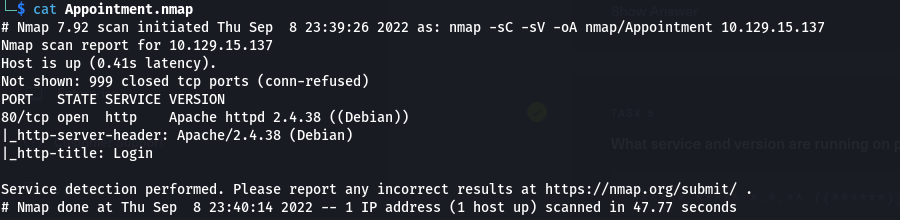
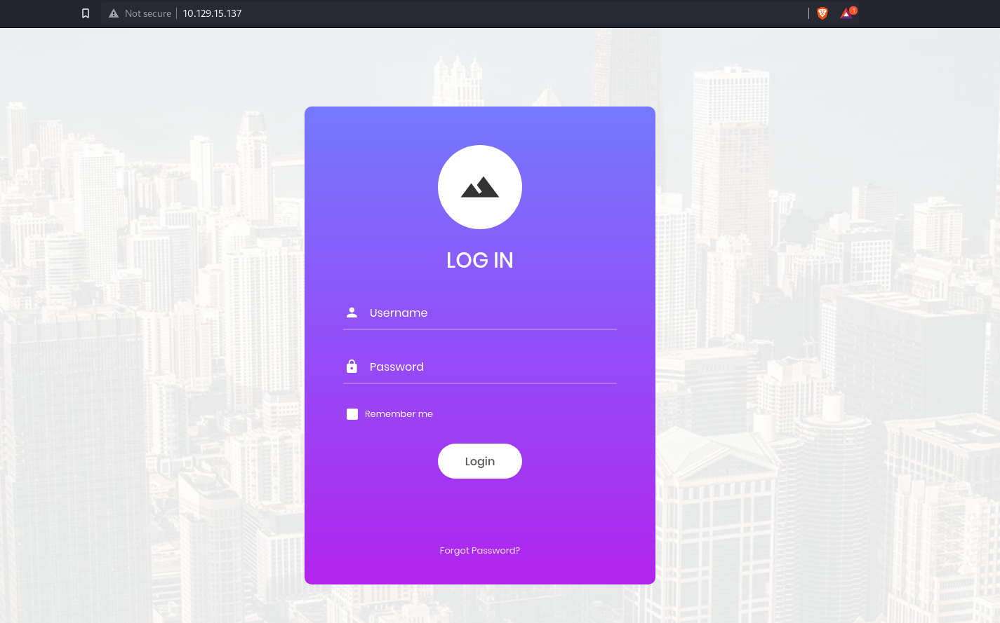
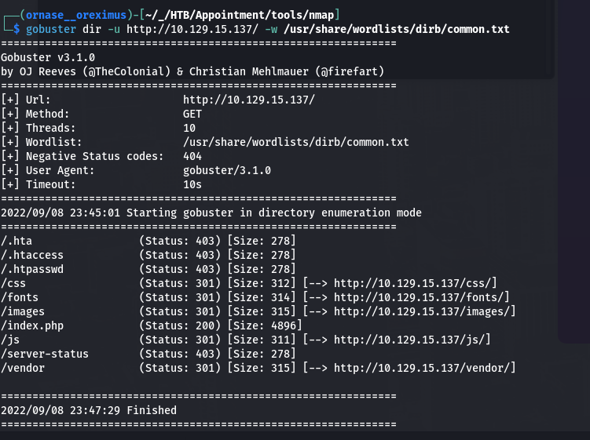

# Appointment (HTB, Starting Point)

## Enumeration
### Checking Connecting

### Ping


- The connectivity is fine, let's dig into the NMAP

### NMAP



- Found that **Apache httpd 2.4.38** service is running on Port **80**.

### On Browser



- We get a login page and also we've tried bunch of common username and passwords there! Nothing works.

### Gobuster



- From the above output we've found that this is a PHP Website.

- Let's try to check if the website is vulnerable to SQL Injection.

### Entering Malicious Input.

```
username: admin'#
password: AnythingUwant
```


- Looks like the Web is Vulnerable to SQL Injection.

**DONE**
