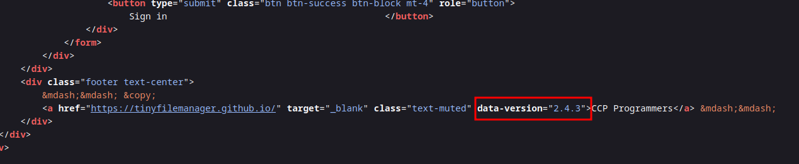
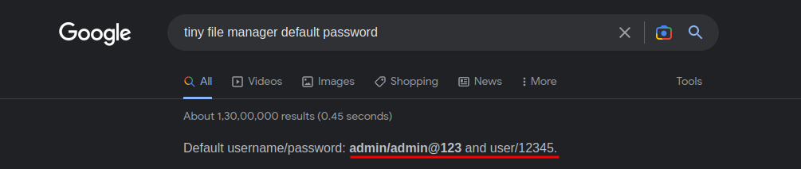
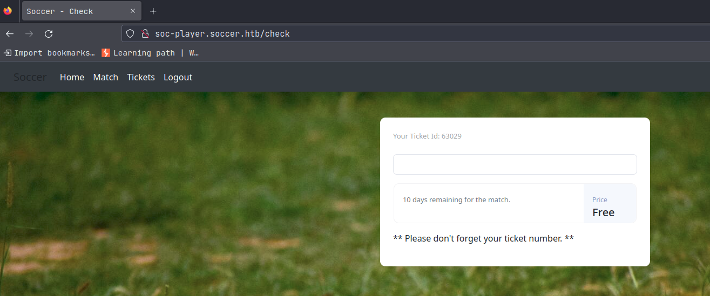

# Soccer

## Difficulty Level: Easy

## Enumeration

### NMAP SCAN

```
# Nmap 7.93 scan initiated Tue Jan 24 09:51:35 2023 as: nmap -sC -sV -oN nmap/soccer -vv 10.10.11.194
Nmap scan report for soccer.htb (10.10.11.194)
Host is up, received syn-ack (0.69s latency).
Scanned at 2023-01-24 09:51:36 IST for 142s
Not shown: 997 closed tcp ports (conn-refused)
PORT     STATE SERVICE         REASON  VERSION
22/tcp   open  ssh             syn-ack OpenSSH 8.2p1 Ubuntu 4ubuntu0.5 (Ubuntu Linux; protocol 2.0)
| ssh-hostkey:
|   3072 ad0d84a3fdcc98a478fef94915dae16d (RSA)
| ssh-rsa AAAAB3NzaC1yc2EAAAADAQABAAABgQChXu/2AxokRA9pcTIQx6HKyiO0odku5KmUpklDRNG+9sa6olMd4dSBq1d0rGtsO2rNJRLQUczml6+N5DcCasAZUShDrMnitsRvG54x8GrJyW4nIx4HOfXRTsNqImBadIJtvIww1L7H1DPzMZYJZj/oOwQHXvp85a2hMqMmoqsljtS/jO3tk7NUKA/8D5KuekSmw8m1pPEGybAZxlAYGu3KbasN66jmhf0ReHg3Vjx9e8FbHr3ksc/MimSMfRq0lIo5fJ7QAnbttM5ktuQqzvVjJmZ0+aL7ZeVewTXLmtkOxX9E5ldihtUFj8C6cQroX69LaaN/AXoEZWl/v1LWE5Qo1DEPrv7A6mIVZvWIM8/AqLpP8JWgAQevOtby5mpmhSxYXUgyii5xRAnvDWwkbwxhKcBIzVy4x5TXinVR7FrrwvKmNAG2t4lpDgmryBZ0YSgxgSAcHIBOglugehGZRHJC9C273hs44EToGCrHBY8n2flJe7OgbjEL8Il3SpfUEF0=
|   256 dfd6a39f68269dfc7c6a0c29e961f00c (ECDSA)
| ecdsa-sha2-nistp256 AAAAE2VjZHNhLXNoYTItbmlzdHAyNTYAAAAIbmlzdHAyNTYAAABBBIy3gWUPD+EqFcmc0ngWeRLfCr68+uiuM59j9zrtLNRcLJSTJmlHUdcq25/esgeZkyQ0mr2RZ5gozpBd5yzpdzk=
|   256 5797565def793c2fcbdb35fff17c615c (ED25519)
|_ssh-ed25519 AAAAC3NzaC1lZDI1NTE5AAAAIJ2Pj1mZ0q8u/E8K49Gezm3jguM3d8VyAYsX0QyaN6H/
80/tcp   open  http            syn-ack nginx 1.18.0 (Ubuntu)
| http-methods:
|_  Supported Methods: GET HEAD
|_http-title: Soccer - Index
|_http-server-header: nginx/1.18.0 (Ubuntu)
9091/tcp open  xmltec-xmlmail? syn-ack
| fingerprint-strings:
|   DNSStatusRequestTCP, DNSVersionBindReqTCP, Help, RPCCheck, SSLSessionReq, drda, informix:
|     HTTP/1.1 400 Bad Request
|     Connection: close
|   GetRequest:
|     HTTP/1.1 404 Not Found
|     Content-Security-Policy: default-src 'none'
|     X-Content-Type-Options: nosniff
|     Content-Type: text/html; charset=utf-8
|     Content-Length: 139
|     Date: Tue, 24 Jan 2023 04:23:08 GMT
|     Connection: close
|     <!DOCTYPE html>
|     <html lang="en">
|     <head>
|     <meta charset="utf-8">
|     <title>Error</title>
|     </head>
|     <body>
|     <pre>Cannot GET /</pre>
|     </body>
|     </html>
|   HTTPOptions:
|     HTTP/1.1 404 Not Found
|     Content-Security-Policy: default-src 'none'
|     X-Content-Type-Options: nosniff
|     Content-Type: text/html; charset=utf-8
|     Content-Length: 143
|     Date: Tue, 24 Jan 2023 04:23:10 GMT
|     Connection: close
|     <!DOCTYPE html>
|     <html lang="en">
|     <head>
|     <meta charset="utf-8">
|     <title>Error</title>
|     </head>
|     <body>
|     <pre>Cannot OPTIONS /</pre>
|     </body>
|     </html>
|   RTSPRequest:
|     HTTP/1.1 404 Not Found
|     Content-Security-Policy: default-src 'none'
|     X-Content-Type-Options: nosniff
|     Content-Type: text/html; charset=utf-8
|     Content-Length: 143
|     Date: Tue, 24 Jan 2023 04:23:11 GMT
|     Connection: close
|     <!DOCTYPE html>
|     <html lang="en">
|     <head>
|     <meta charset="utf-8">
|     <title>Error</title>
|     </head>
|     <body>
|     <pre>Cannot OPTIONS /</pre>
|     </body>
|_    </html>
1 service unrecognized despite returning data. If you know the service/version, please submit the following fingerprint at https://nmap.org/cgi-bin/submit.cgi?new-service :
SF-Port9091-TCP:V=7.93%I=7%D=1/24%Time=63CF5D13%P=x86_64-pc-linux-gnu%r(in
SF:formix,2F,"HTTP/1\.1\x20400\x20Bad\x20Request\r\nConnection:\x20close\r
SF:\n\r\n")%r(drda,2F,"HTTP/1\.1\x20400\x20Bad\x20Request\r\nConnection:\x
SF:20close\r\n\r\n")%r(GetRequest,168,"HTTP/1\.1\x20404\x20Not\x20Found\r\
SF:nContent-Security-Policy:\x20default-src\x20'none'\r\nX-Content-Type-Op
SF:tions:\x20nosniff\r\nContent-Type:\x20text/html;\x20charset=utf-8\r\nCo
SF:ntent-Length:\x20139\r\nDate:\x20Tue,\x2024\x20Jan\x202023\x2004:23:08\
SF:x20GMT\r\nConnection:\x20close\r\n\r\n<!DOCTYPE\x20html>\n<html\x20lang
SF:=\"en\">\n<head>\n<meta\x20charset=\"utf-8\">\n<title>Error</title>\n</
SF:head>\n<body>\n<pre>Cannot\x20GET\x20/</pre>\n</body>\n</html>\n")%r(HT
SF:TPOptions,16C,"HTTP/1\.1\x20404\x20Not\x20Found\r\nContent-Security-Pol
SF:icy:\x20default-src\x20'none'\r\nX-Content-Type-Options:\x20nosniff\r\n
SF:Content-Type:\x20text/html;\x20charset=utf-8\r\nContent-Length:\x20143\
SF:r\nDate:\x20Tue,\x2024\x20Jan\x202023\x2004:23:10\x20GMT\r\nConnection:
SF:\x20close\r\n\r\n<!DOCTYPE\x20html>\n<html\x20lang=\"en\">\n<head>\n<me
SF:ta\x20charset=\"utf-8\">\n<title>Error</title>\n</head>\n<body>\n<pre>C
SF:annot\x20OPTIONS\x20/</pre>\n</body>\n</html>\n")%r(RTSPRequest,16C,"HT
SF:TP/1\.1\x20404\x20Not\x20Found\r\nContent-Security-Policy:\x20default-s
SF:rc\x20'none'\r\nX-Content-Type-Options:\x20nosniff\r\nContent-Type:\x20
SF:text/html;\x20charset=utf-8\r\nContent-Length:\x20143\r\nDate:\x20Tue,\
SF:x2024\x20Jan\x202023\x2004:23:11\x20GMT\r\nConnection:\x20close\r\n\r\n
SF:<!DOCTYPE\x20html>\n<html\x20lang=\"en\">\n<head>\n<meta\x20charset=\"u
SF:tf-8\">\n<title>Error</title>\n</head>\n<body>\n<pre>Cannot\x20OPTIONS\
SF:x20/</pre>\n</body>\n</html>\n")%r(RPCCheck,2F,"HTTP/1\.1\x20400\x20Bad
SF:\x20Request\r\nConnection:\x20close\r\n\r\n")%r(DNSVersionBindReqTCP,2F
SF:,"HTTP/1\.1\x20400\x20Bad\x20Request\r\nConnection:\x20close\r\n\r\n")%
SF:r(DNSStatusRequestTCP,2F,"HTTP/1\.1\x20400\x20Bad\x20Request\r\nConnect
SF:ion:\x20close\r\n\r\n")%r(Help,2F,"HTTP/1\.1\x20400\x20Bad\x20Request\r
SF:\nConnection:\x20close\r\n\r\n")%r(SSLSessionReq,2F,"HTTP/1\.1\x20400\x
SF:20Bad\x20Request\r\nConnection:\x20close\r\n\r\n");
Service Info: OS: Linux; CPE: cpe:/o:linux:linux_kernel

Read data files from: /usr/bin/../share/nmap
Service detection performed. Please report any incorrect results at https://nmap.org/submit/ .
# Nmap done at Tue Jan 24 09:53:58 2023 -- 1 IP address (1 host up) scanned in 142.32 seconds
```

- A webserver is running on the target and also a ssh service is running on it.

### Web Enumeration


- A simple homepage with less details and information. Also by checking it's source code we found nothing confidential there too.

### Directory Searching

**Feroxbuster Scan**

**command**:
```
feroxbuster -u http://soccer.htb/ -w /usr/share/seclists/Discovery/Web-Content/directory-list-1.0.txt -k -o feroxbuster/feroxbuster.txt
```

**output:**
```
200      GET      147l      526w     6917c http://soccer.htb/
403      GET        7l       10w      162c http://soccer.htb/.hta
403      GET        7l       10w      162c http://soccer.htb/.htpasswd
403      GET        7l       10w      162c http://soccer.htb/.htaccess
200      GET      147l      526w     6917c http://soccer.htb/index.html
200      GET      147l      526w     6917c http://soccer.htb/
301      GET        7l       12w      178c http://soccer.htb/tiny => http://soccer.htb/tiny/
301      GET        7l       12w      178c http://soccer.htb/tiny/uploads => http://soccer.htb/tiny/uploads/
```

- from a basic web-contents list, we found a page called **tiny**


- We have a login page of **tiny file manager**, and from the page source we found this running the version **2.4.3**;



- Also by googling, we found the **default credentials** for **tiny file manager**, which we can try on the login page.



- They worked just fine!


- Let's try to upload the reverse shell and get access to the target!

### Initial Foothold

- Uploading our PHP reverse shell, in **tiny/uploads**:


- Now start the netcat listener on the configured port which is mentioned in your reverse shell script.

- Then open the directory where our file is uploaded and then open it's direct link to run our reverse shell.


- We're in... now let's enumerate more on the target!

### Target Enumeration

**Linpeas**

- From the enumeration script we found a useful file which should contain some useful information related to the website; location: **/etc/nginx/sites-enabled/soc-player.htb**


- Also by concatenating the content of the file, provide us with a subdomain of a website; subdomain: **soc-player.soccer.htb**


- Now after this subdomain in our /etc/hosts file, we revisited the website.
- And this time it shows several pages on the top menu.


**Login Page**


- We've have a login page and there is also a option to sign-up (**Didn't have an Account**)
- Let's create an account for ourselves:


- We've provided the random details to try it out!

- After creating an account, login with the credentials we are redirected to this **/check** page;



- And by checking the source of the page we found that a **websocket connection** is initiated on the website after we logged-in.

👉[**More about websockets**](https://book.hacktricks.xyz/pentesting-web/cross-site-websocket-hijacking-cswsh#what-are-websockets)👈


