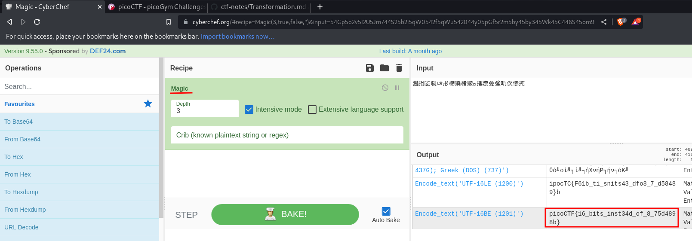

# Transformation

- This CTF challenge is related to reverse engineering, and we'll see the encoding and decoding concepts.

## Checking the File Properties
**FILE: enc**

from **file** command we found these properties:

```
enc: Unicode text, UTF-8 text, with no line terminators
```

- file  contents
```
灩捯䍔䙻ㄶ形楴獟楮獴㌴摟潦弸強㕤㐸㤸扽
```

- From the challenge a python program is provided to understand the encyrption:
```
''.join([chr((ord(flag[i]) << 8) + ord(flag[i + 1])) for i in range(0, len(flag), 2)])
```

- Formatting and running this program into our Code Editor:
```
flag = "picoCTF{gjfghj}}"
coolfunction = ''.join(
[chr(
(ord(flag[i]) << 8)
+
ord(flag[i + 1])
)
for i in range(0, len(flag), 2)
]
)
print(coolfunction)
```

- It does output some unicode characters:
```
剅摣歫死杪晧桪絽
```

- Also from the Hint we are suggested to check some online decoders:
- Trying on cyberchef.org:

- Tested with the **magic** recipe, it worked!